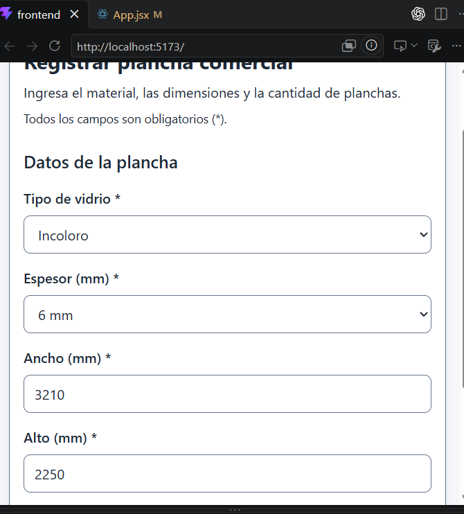
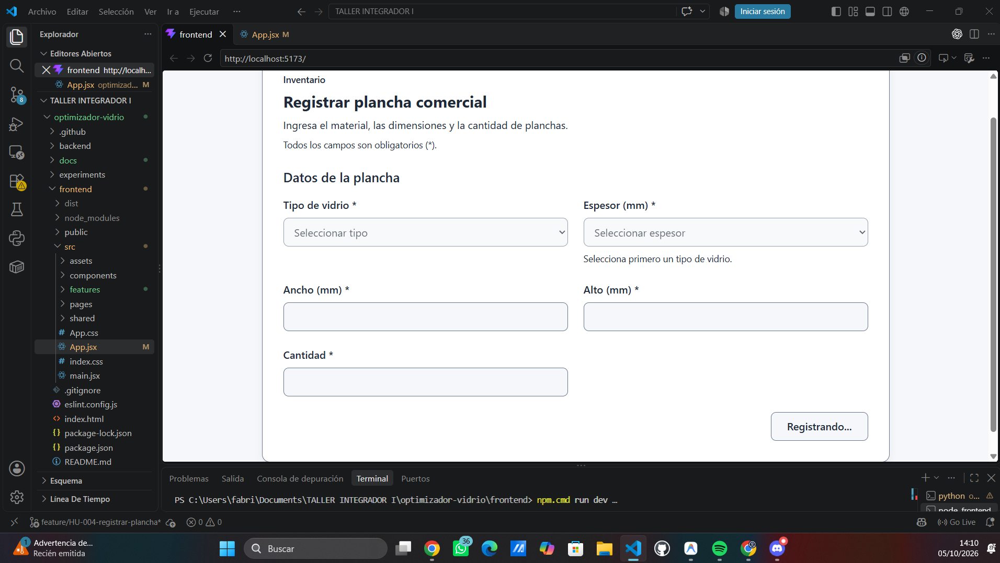
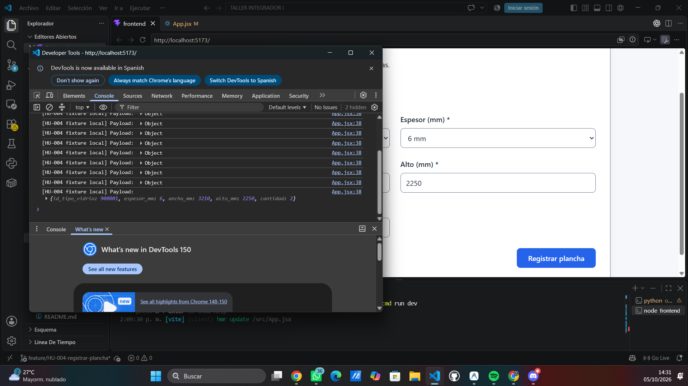

# HU-004: formulario de plancha comercial

## Objetivo y contexto

Documentar la implementación de T01/T03 y su relación con los criterios CA-01 a CA-03 y CA-07 a CA-11 de la [SPEC HU-004](../../../specs/SPEC-HU-004-registrar-plancha.md).

- Rama consultada: `feature/HU-004-registrar-plancha`.
- HEAD consultado al preparar la evidencia: `c2b5d05e5ec7bec0b52b1bfbab720f3429aabb7b`.
- La SPEC y los archivos del formulario están sin commit y sin seguimiento; el HEAD no contiene esta implementación.
- Fuente: revisión del código actual y verificaciones de desarrollo ejecutadas en esta sesión, detalladas en [validaciones-plancha.md](validaciones-plancha.md).
- Actualización de verificación: 05/10/2026, según la comprobación funcional y visual manual reportada por el usuario. Estos resultados no se presentan como una ejecución de navegador realizada por el asistente.

## Archivos implementados

- Componente: [RegistrarPlanchaForm.jsx](../../../../frontend/src/features/inventory/RegistrarPlanchaForm.jsx).
- Estilos: [RegistrarPlanchaForm.css](../../../../frontend/src/features/inventory/RegistrarPlanchaForm.css).

El formulario incluye tipo de vidrio, espesor, ancho en mm, alto en mm y cantidad. Todos son obligatorios, con labels visibles, asterisco e instrucción explícita de obligatoriedad.

## Contrato y comportamiento

| Elemento | Implementación |
|---|---|
| Catálogo | Recibido mediante la prop `catalogo`; no hay HTTP, importación de servicios API ni catálogo hardcodeado. |
| Tipos disponibles | Filtra los tipos con `estado: true`; no presupone IDs fijos. |
| Espesores | Se derivan exclusivamente de `espesores_mm` del tipo seleccionado. |
| Cambio de tipo | Limpia inmediatamente el espesor seleccionado y actualiza sus opciones. |
| Catálogo vacío o incompleto | Presenta ayuda textual; los selectores sin opciones quedan deshabilitados. |
| Envío | `onSubmit` es una función recibida por props; recibe `id_tipo_vidrio`, `espesor_mm`, `ancho_mm`, `alto_mm` y `cantidad` como números, solo si no hay errores. |
| Procesamiento | `isSubmitting` y el estado interno de una promesa pendiente bloquean el formulario; el botón muestra «Registrando...». Una referencia interna evita invocaciones duplicadas antes del siguiente render. |

El componente conserva los datos ante un error de envío. Se montó temporalmente en `App.jsx` para la verificación manual, sin HTTP y con `onSubmit` limitado a mostrar el payload en consola. El montaje fue retirado: se comprobó que `App.jsx` vuelve a renderizar Login y NuevoPedido, sin diferencias en Git, fixtures ni referencias al montaje temporal. El componente definitivo permanece desacoplado; la integración E2E corresponde a TA-011.

## Línea base UI/UX y accesibilidad implementada

Se aplicó `Documento_Diseno_UI_UX_Accesibilidad_NewGlass_v1_0`, leído para esta implementación, y la guía de [docs/ui-ux](../../../ui-ux/README.md). Los valores están localizados en el CSS del componente, sin modificar tokens globales.

- Tonos azules y superficies claras: acento `#61A3E7`, acción principal `#2563EB`, foco `#1D4ED8`, texto `#1F2937`, fondo de ayudas/estados `#F5F7FA`, superficie `#FFFFFF` y error `#B91C1C`.
- Tipografía `Inter, system-ui, Arial, sans-serif`, espaciado basado en 4/8 px, controles con altura mínima de 44 px, radio de 8 px en controles y 12 px en la tarjeta.
- Labels visibles asociados con `htmlFor/id`; no dependen del placeholder.
- Foco visible con `:focus-visible` en inputs, selects y botón; controles HTML nativos y sin `tabindex` positivos.
- `aria-invalid` refleja el estado de error; los mensajes textuales próximos al campo se asocian mediante `aria-describedby`.
- La ayuda del selector de espesor tiene un ID estable. `aria-describedby` puede referenciar simultáneamente la ayuda y el error.
- Botón con estados default, hover, focus, disabled y loading; los errores y estados se comunican con texto, además del color.
- Layout de dos columnas que pasa a una columna a anchuras de 600 px o menores.

Estas características están implementadas en el código. Las comprobaciones manuales siguientes no equivalen a una auditoría completa ni a una declaración de conformidad WCAG.

## Verificación manual realizada — 05/10/2026

Resultados reportados por el usuario durante el montaje temporal:

| Aspecto | Resultado observado |
|---|---|
| Estado normal | Formulario visible con cinco campos obligatorios. |
| Catálogo | Solo tipos activos; espesores dependientes del tipo y limpieza del espesor al cambiar el tipo. |
| Errores | Mensajes textuales próximos a los campos; el error no se comunica únicamente mediante color. |
| Foco y navegación | Se comprobaron el foco visible, la navegación y los controles semánticos. |
| Loading/disabled | Con `isSubmitting=true`, controles y botón deshabilitados, texto `Registrando...`, layout estable y prevención visual de doble envío. |
| Responsive | Aproximadamente a 375 px, disposición a una columna y controles utilizables, sin solapamientos ni pérdida funcional observada. |
| Envío válido | `onSubmit` recibió los cinco valores numéricos indicados a continuación. |

```json
{
  "id_tipo_vidrio": 900001,
  "espesor_mm": 6,
  "ancho_mm": 3210,
  "alto_mm": 2250,
  "cantidad": 2
}
```

Los IDs `900001–900004` fueron exclusivamente fixtures locales de verificación. Ya no forman parte de la implementación definitiva ni constituyen el catálogo del sistema. Este envío a consola no creó registros API/BD.

## Evidencia visual inspeccionada

Las cuatro imágenes aportadas fueron abiertas e inspeccionadas individualmente. Se conservaron completas, sin recorte, compresión ni regeneración; solo se cambiaron los nombres y se verificó que sus hashes SHA-256 permanecen iguales. Corresponden al montaje temporal local, no a una conexión E2E ni a la implementación actual de `App.jsx`.

### Formulario y disposición en una columna

La imagen muestra Incoloro, espesor 6 mm, ancho 3210 y alto 2250, labels con asterisco y la instrucción de obligatoriedad. Aporta evidencia parcial de CA-01/CA-02 y de la adaptación a una columna. El título aparece parcialmente fuera de la vista y cantidad/botón no se ven en este encuadre. No hay indicador de anchura del viewport: la captura no acredita por sí sola los 375 px de la comprobación manual reportada.



### Cinco campos, layout de escritorio y loading/disabled

La captura muestra los cinco campos obligatorios, la disposición de escritorio en dos columnas, controles con apariencia deshabilitada y el botón con texto `Registrando...`. Sustenta CA-01/CA-02 y el estado visual de envío reportado con `isSubmitting=true`. Una imagen estática no prueba por sí sola el bloqueo de eventos ni la estabilidad del layout durante toda la transición.



### Payload válido en consola

La consola muestra `[HU-004 fixture local] Payload:` y el objeto con los cinco valores numéricos: `id_tipo_vidrio: 900001`, `espesor_mm: 6`, `ancho_mm: 3210`, `alto_mm: 2250`, `cantidad: 2`. Sustenta el contrato desacoplado de `onSubmit`; el formulario queda parcialmente cubierto por DevTools. Hay varias entradas de consola y no se infiere de ellas una prueba de prevención de doble envío. No acredita persistencia ni llamadas API.



La captura de errores y foco se presenta con sus criterios en [validaciones-plancha.md](validaciones-plancha.md#evidencia-visual-de-validaciones-y-foco).

### Trazabilidad de nombres

| Nombre original | Nombre estable | Contenido principal |
|---|---|---|
| `Imagen de ChatGPT 5 oct 2026, 03_17_23 p.m.png` | `formulario-responsive-columna.png` | Vista parcial del formulario con datos en una columna |
| `Imagen de ChatGPT 5 oct 2026, 03_17_38 p.m.png` | `payload-on-submit.png` | Payload numérico en consola |
| `Imagen de ChatGPT 5 oct 2026, 03_17_45 p.m.png` | `formulario-loading.png` | Cinco campos, layout de escritorio y `Registrando...` |
| `Imagen de ChatGPT 5 oct 2026, 03_18_05 p.m.png` | `formulario-validaciones-foco.png` | Mensajes por campos faltantes y foco en ancho |

No se identificaron capturas redundantes: cada una aporta información distinta y se conservaron las cuatro. Ninguna muestra API o PostgreSQL/Supabase; no se incorporaron a `registro-api-bd.md`.

## Artefactos y límites

Las imágenes documentan los estados visibles descritos; no hay una vista completa adicional del formulario normal ni una captura que muestre la medida exacta del viewport. Las comprobaciones manuales previas se conservan como resultados reportados, separadas de lo que puede demostrarse con cada imagen. **Lighthouse no se ejecutó.** No se atribuyen resultados de auditorías automatizadas ni de un checklist exhaustivo no proporcionado. La integración E2E completa permanece en TA-011.
