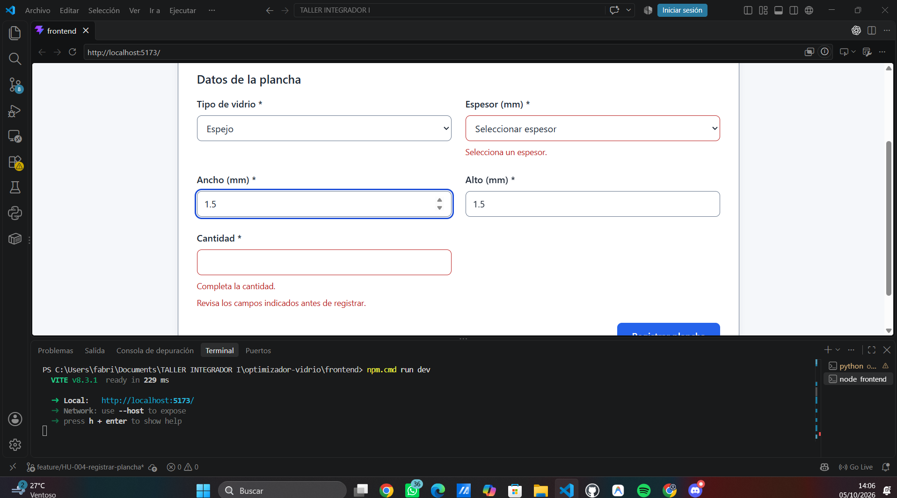

# HU-004: validaciones del formulario

## Objetivo y contexto

Documentar las reglas implementadas en T03 y las verificaciones de desarrollo efectivamente ejecutadas para la [SPEC HU-004](../../../specs/SPEC-HU-004-registrar-plancha.md).

- Rama: `feature/HU-004-registrar-plancha`.
- HEAD consultado al preparar la evidencia: `c2b5d05e5ec7bec0b52b1bfbab720f3429aabb7b`.
- El componente y sus estilos están sin commit y sin seguimiento. Las verificaciones se ejecutaron sobre el árbol de trabajo, no sobre una versión comprometida de HU-004.

## Reglas implementadas

| Regla | Comportamiento en el componente | Trazabilidad |
|---|---|---|
| Tipo obligatorio | Exige seleccionar un tipo activo disponible en el catálogo recibido. | CA-03, CA-10 |
| Espesor obligatorio | Exige una selección de espesor. | CA-03, CA-10 |
| Ancho mayor que cero | Rechaza vacío, cero, negativos y valores no finitos. | CA-07, CA-10 |
| Alto mayor que cero | Rechaza vacío, cero, negativos y valores no finitos. | CA-08, CA-10 |
| Cantidad positiva y entera | Rechaza vacío, cero, negativos, decimales y valores que no sean enteros seguros de JavaScript. | CA-09, CA-10 |
| Compatibilidad tipo–espesor | Verifica el espesor contra `espesores_mm` del tipo activo seleccionado, sin lista hardcodeada. | CA-11 |
| Cambio de tipo | Limpia el espesor seleccionado y actualiza las opciones. | CA-11 |
| Errores de validación | Muestra mensajes junto a los campos y no invoca `onSubmit`. | CA-03, CA-07 a CA-11 |
| Doble submit | Bloquea envíos con `isSubmitting`, mientras la promesa de `onSubmit` está pendiente y mediante una referencia interna de envío. | RN-07 y estado de envío |

Los campos conservan labels visibles y errores textuales. `aria-invalid` representa el error y `aria-describedby` enlaza sus mensajes; el selector de espesor puede enlazar ayuda y error simultáneamente. La validación final de negocio permanece en backend/BD.

La tabla describe las reglas implementadas. Las verificaciones manuales realmente reportadas por el usuario se detallan a continuación; no se infieren pruebas adicionales para cada caso límite del código.

## Verificación manual realizada — 05/10/2026

- Se comprobaron el formulario normal y los cinco campos obligatorios.
- Se verificaron los tipos activos, los espesores dependientes del tipo y la limpieza del espesor al cambiar de tipo.
- Se observaron errores textuales próximos a los campos, sin depender únicamente del color, además de foco visible, navegación y controles semánticos.
- Con `isSubmitting=true` se comprobaron controles y botón deshabilitados, texto `Registrando...`, layout estable y prevención visual de doble envío.
- Aproximadamente a 375 px se verificaron una sola columna, controles utilizables y ausencia de solapamientos o pérdida funcional observada.
- `onSubmit` recibió valores numéricos: `id_tipo_vidrio: 900001`, `espesor_mm: 6`, `ancho_mm: 3210`, `alto_mm: 2250` y `cantidad: 2`.

Estas verificaciones fueron realizadas manualmente y reportadas por el usuario. El payload se mostró en consola sin HTTP. Los IDs `900001–900004` eran fixtures locales del montaje de desarrollo y fueron retirados. Se confirmó que `App.jsx` está restaurado, sin fixtures ni montaje temporal.

## Verificaciones ejecutadas

Lint y build se ejecutaron en la sesión de implementación, corrección accesible y preparación del montaje temporal. Ambos se repitieron para el cierre documental, con `App.jsx` restaurado, y terminaron con código 0. `git status --short` confirmó que `App.jsx` no aparece entre los cambios; su contenido tampoco conserva fixtures ni montaje temporal. `git diff --check` se ejecuta nuevamente al finalizar la actualización.

| Directorio | Comando | Resultado observado |
|---|---|---|
| `frontend/` | `npm.cmd run lint` | Código 0; ESLint finalizó sin diagnósticos. |
| `frontend/` | `npm.cmd run build` | Código 0; Vite completó el build. |
| Raíz del repositorio | `git diff --check` | Código 0, sin salida. |

Se utilizó `npm.cmd` porque PowerShell bloqueaba el lanzador `npm.ps1`. No se agregaron dependencias ni se cambió la política de ejecución.

Durante la implementación inicial, sin montar el componente en `App.jsx`, se compiló también aisladamente con Vite en memoria, sin escribir artefactos, con código 0. La corrección de `aria-describedby` volvió a pasar lint y build. El montaje temporal posterior pasó ambos comandos e incluyó el formulario en el build. Actualmente `App.jsx` está restaurado. La compilación por sí sola no acredita una prueba funcional; las comprobaciones manuales se registran por separado.

`git diff --check` no incluye archivos untracked. En la revisión previa se comprobó adicionalmente el whitespace del JSX mediante `git diff --no-index --check -- /dev/null frontend/src/features/inventory/RegistrarPlanchaForm.jsx`, sin incidencias.

## Evidencia visual de validaciones y foco

La captura muestra Espejo seleccionado, espesor sin seleccionar y cantidad vacía. Junto a los campos aparecen `Selecciona un espesor.` y `Completa la cantidad.`, además de `Revisa los campos indicados antes de registrar.`. Sustenta visualmente la identificación de obligatorios faltantes de CA-03/CA-10: el error tiene texto y no depende únicamente del borde rojo. La imagen estática no acredita por sí sola que `onSubmit` no se haya invocado.

El campo Ancho contiene `1.5` y presenta un contorno azul de foco claramente visible; Alto contiene `1.5`. Esta imagen no representa errores por dimensiones no positivas, cantidad decimal ni una combinación tipo–espesor inválida. Tampoco permite comprobar los atributos ARIA o un recorrido completo por teclado.

La [captura de loading](formulario-loading.png) muestra los controles con apariencia deshabilitada y el botón `Registrando...`; la [vista en una columna](formulario-responsive-columna.png) aporta evidencia parcial del responsive, sin indicar el ancho exacto del viewport. Su contexto y límites se detallan en [formulario-plancha.md](formulario-plancha.md#evidencia-visual-inspeccionada).

## Validación API y pendientes

Los casos API reportados por el usuario se conservan en [prueba-funcional.md](prueba-funcional.md): alta válida HTTP 201 y rechazos HTTP 422 por ancho cero y combinación inválida; la consulta final devolvió una sola plancha. Son verificaciones independientes del montaje visual del formulario.

La revisión visual y las comprobaciones de foco/navegación fueron reportadas como realizadas. Se referencia ahora la captura existente de errores y foco, sin atribuirle pruebas adicionales ni una auditoría exhaustiva de accesibilidad. **Lighthouse no se ejecutó.** La conexión E2E del formulario corresponde a TA-011.
